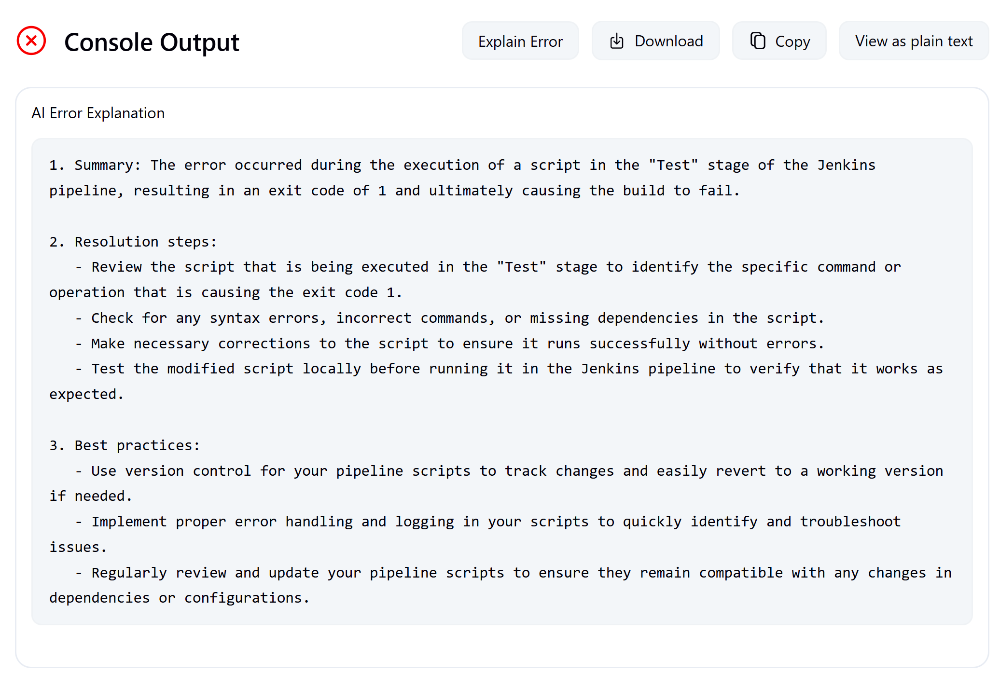

# Explain Error Plugin

[](https://plugins.jenkins.io/explain-error/)
[](https://github.com/jenkinsci/explain-error-plugin/releases/latest)
[](https://plugins.jenkins.io/explain-error/)

AI-powered Jenkins plugin that explains pipeline and job failures with human-readable insights.

## Overview

The Explain Error Plugin transforms cryptic build error logs into clear, actionable insights using AI technology. Whether you're dealing with compilation errors, test failures, or deployment issues, this plugin helps you understand what went wrong and how to fix it.

## Table of Contents

- [Key Features](#key-features)
- [Quick Start](#quick-start)
- [Usage](#usage)
  - [Pipeline Step](#method-1-pipeline-step)
  - [Manual Console Analysis](#method-2-manual-console-analysis)
- [Troubleshooting](#troubleshooting)
- [Best Practices](#best-practices)
- [Support & Community](#support--community)
- [License](#license)
- [Acknowledgments](#acknowledgments)

## Key Features

- **AI-Powered Analysis**: Integrates with OpenAI GPT models to analyze error logs intelligently
- **Pipeline Integration**: Simple `explainError()` step for seamless pipeline integration
- **One-Click Analysis**: Direct "Explain Error" button on console output pages
- **Rich Web UI**: View detailed explanations in the Jenkins web interface
- **Highly Configurable**: Customize API endpoints, models, and analysis parameters

## Quick Start

### Prerequisites

- Jenkins 2.479.3 or newer
- Java 17 or later
- OpenAI API account

### Installation

1. **Install via Jenkins Plugin Manager:**
   - Go to `Manage Jenkins` → `Manage Plugins` → `Available`
   - Search for "Explain Error Plugin"
   - Click `Install` and restart Jenkins

2. **Manual Installation:**
   - Download the `.hpi` file from [releases](https://github.com/jenkinsci/explain-error-plugin/releases)
   - Upload via `Manage Jenkins` → `Manage Plugins` → `Advanced`

### Configuration

1. Navigate to `Manage Jenkins` → `Configure System`
2. Find the **"Explain Error Plugin Configuration"** section
3. Configure the following settings:

| Setting | Description | Default |
|---------|-------------|---------|
| **Enable AI Error Explanation** | Toggle plugin functionality | ✅ Enabled |
| **API Key** | Your OpenAI API key | *Required* |
| **API URL** | AI service endpoint | `https://api.openai.com/v1/chat/completions` |
| **AI Model** | Model to use for analysis | `gpt-3.5-turbo` |

4. Click **"Test Configuration"** to verify your setup
5. Save the configuration


## Usage

There are two ways to use the Explain Error Plugin:

### Method 1: Pipeline Step

Add the `explainError()` step to your pipeline, typically in the `post` section:

```groovy
pipeline {
    agent any
    stages {
        stage('Build') {
            steps {
                script {
                    // Your build steps here
                    sh 'make build'
                }
            }
        }
    }
    post {
        failure {
            // Automatically explain errors when build fails
            explainError()
        }
    }
}
```

**Benefits:**
- ✅ Automatic error analysis on build failures
- ✅ Results appear in build sidebar
- ✅ Works with all pipeline types

And see output from side panel if the job failed.


### Method 2: Manual Console Analysis

For any build (including non-pipeline jobs), you can manually trigger error analysis:

1. **Navigate** to any build's console output page
2. **Click** the "Explain Error" button above the console output
3. **Wait** for the AI to analyze the console output
4. **View** the explanation that appears below the button

**Benefits:**
- ✅ Works with any Jenkins job type (Freestyle, Pipeline, etc.)
- ✅ On-demand analysis
- ✅ No pipeline modifications required



## Troubleshooting

### Common Issues

| Issue | Solution |
|-------|----------|
| **"API key not configured"** | Add your OpenAI API key in Jenkins global configuration |
| **"Authentication failed"** | Verify your API key is valid and has sufficient credits |
| **"Rate limit exceeded"** | Reduce usage frequency or upgrade your OpenAI plan |
| **Plugin not appearing** | Ensure Jenkins version ≥ 2.479.3 and restart after installation |

### Debug Mode

Enable debug logging in Jenkins:
1. Go to `Manage Jenkins` → `System Log`
2. Add logger for `io.jenkins.plugins.explain_error`
3. Set level to `FINE` or `ALL`

## Best Practices

1. **Use in post sections**: Add `explainError()` in pipeline `post` blocks for automatic analysis
3. **Monitor API usage**: Keep track of your OpenAI API usage and costs
4. **Combine with notifications**: Integrate with Slack/email notifications for team awareness
5. **Regular updates**: Keep the plugin updated for latest features and security fixes

## Support & Community

### Getting Help

- **Bug Reports**: [GitHub Issues](https://github.com/jenkinsci/explain-error-plugin/issues)
- **Feature Requests**: [GitHub Discussions](https://github.com/jenkinsci/explain-error-plugin/discussions)
- **Contributing**: We welcome contributions! Please see our [Contributing Guide](CONTRIBUTING.md)
- **Security Issues**: Report privately to security@jenkins.io

## License

This project is licensed under the MIT License - see the [LICENSE](LICENSE.md) file for details.

## Acknowledgments

**Made with ❤️ for the Jenkins community**

If this plugin has helped you or your team, we'd appreciate your support:

⭐ **Star us on GitHub** - [jenkinsci/explain-error-plugin](https://github.com/jenkinsci/explain-error-plugin)

Your star helps others discover this plugin and motivates us to keep improving it!
